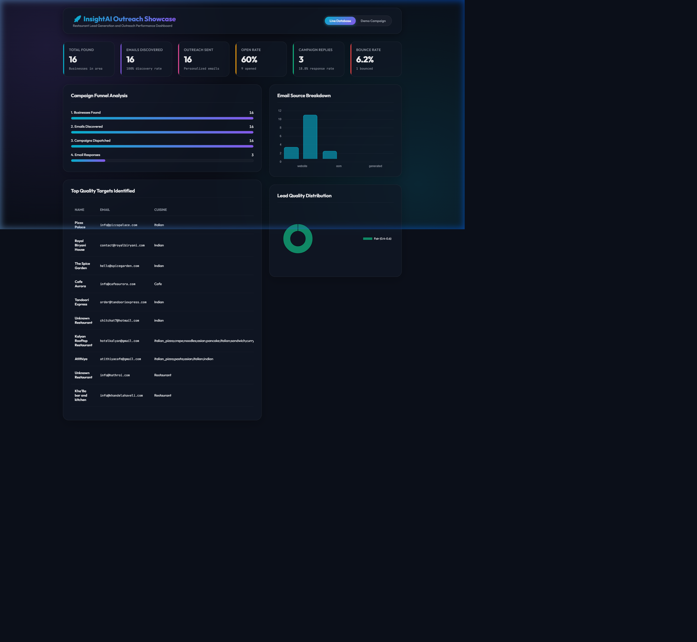

# 🚀 Multi-Business Outreach Agent

> A personal lead-generation and outreach workflow for restaurants, tech companies, HR firms, e-commerce, and service businesses.

---

## 📊 Campaign Analytics Showcase Dashboard

The agent now includes a beautiful, interactive, and fully responsive **Showcase Dashboard** at `dashboard.html` that visualizes lead funnels, cuisine performance, lead quality distribution, and email sources directly from the SQL database:

* **Desktop Layout**: Features side-by-side funnel progression cards, high-quality target tables, and Chart.js distribution charts.
* **Mobile Responsive**: Dynamically adjusts using CSS flex/grid media queries to fit mobile, tablet, and desktop screens perfectly.
* **Live / Demo Toggle**: Features an interactive switch to view simulated campaign demo outreach statistics or live SQL database records.



---

## ⚡ Quick Start (5 Minutes)

### 1. Install Dependencies

```bash
pip install -r requirements.txt
```

### 2. Set Up Environment

```bash
# Copy example file
cp .env.example .env

# Edit .env and add your keys:
# - OPENAI_API_KEY (for message generation)
# - EMAIL_ADDRESS & EMAIL_PASSWORD (Gmail account)
```

### 3. Run First Campaign

```bash
# Step 1: Find businesses and emails
python core/workflow.py --scrape --type=restaurant

# When asked, choose:
# 1 = Export to CSV (review results)
# 2 = Send emails (start campaign)
```

### 4. Check Results

```bash
# View statistics
python core/workflow.py --stats

# Export to CSV
python core/workflow.py --export

# Results saved to: results/ folder
```

---

## 📚 Documentation

| Guide                                                           | Purpose                                     |
| --------------------------------------------------------------- | ------------------------------------------- |
| **[ARCHITECTURE.md](ARCHITECTURE.md)**                     | 📁 Folder structure & how code is organized |
| **[QUICK_START.md](docs/QUICK_START.md)**                  | ⚡ Get running in 5 minutes                 |
| **[EMAIL_FINDING_STRATEGY.md](EMAIL_FINDING_STRATEGY.md)** | 🎯 How the email discovery flow works       |
| **[MULTI_BUSINESS_GUIDE.md](MULTI_BUSINESS_GUIDE.md)**     | 🏢 Use for restaurants, tech, HR, etc.      |
| **[docs/API_KEYS.md](docs/API_KEYS.md)**                   | 🔑 Setup optional lookup and message tools  |
| **[docs/DATABASE_SCHEMA.md](docs/DATABASE_SCHEMA.md)**     | 🗄️ SQLite database structure              |
| **[docs/TROUBLESHOOTING.md](docs/TROUBLESHOOTING.md)**     | 🐛 Fix common errors                        |

---

## 🎯 What Does This Do?

### ✅ The 3-Step Workflow

```
STEP 1: SCRAPE
Find businesses using OpenStreetMap
↓
Extract contact emails (multi-step discovery flow)
↓
Save to database

    ↓ Choose your action ↓

STEP 2A: EXPORT          STEP 2B: SEND EMAILS
Review in Excel    OR   Generate personalized emails
Import to CRM          Send via Gmail
                              Track engagement

STEP 3: FOLLOW-UP (Optional)
Send reminder emails on Day 3 and Day 7
```

### 🏢 Supports Multiple Business Types

```bash
# Find restaurants
python core/workflow.py --scrape --type=restaurant

# Find tech companies  
python core/workflow.py --scrape --type=solution_company

# Find HR/staffing agencies
python core/workflow.py --scrape --type=hr_company

# Find e-commerce businesses
python core/workflow.py --scrape --type=ecommerce

# Find service providers
python core/workflow.py --scrape --type=service_business
```

---

## 📁 Folder Structure (Easy Version)

```
RESTAURANT AGENT/
│
├── 📁 core/              Main workflow files
│   ├── workflow.py      Entry point (START HERE)
│   ├── scraper.py       Finds businesses & emails
│   └── agent.py         Sends emails
│
├── 📁 config/           Settings & configuration
│   ├── config.py        API keys & location
│   └── search_config.py Business type definitions
│
├── 📁 utils/            Helper functions
│   ├── email_finder.py   Finds emails (multi-step discovery)
│   ├── email_sender.py   Sends via Gmail
│   ├── search.py         Queries OpenStreetMap
│   ├── filter.py         Ranks businesses
│   ├── database.py       SQLite management
│   ├── ai_email.py       OpenAI email generation
│   └── export.py         CSV export
│
├── 📁 data/             Local data storage
│   └── agent.db         SQLite database (auto-created)
│
├── 📁 results/          Output folder
│   └── contacts_*.csv   Exported data
│
├── 📁 docs/             Documentation & guides
│   ├── QUICK_START.md
│   ├── API_KEYS.md
│   └── TROUBLESHOOTING.md
│
├── requirements.txt     Python dependencies
├── .env.example        Example environment file
└── README.md           This file
```

**See [ARCHITECTURE.md](ARCHITECTURE.md) for detailed folder breakdown!**
--------------------------------------------------

## 🚀 Common Tasks

### Task 1: Find Restaurants & Export

```bash
# Step 1: Find businesses
python core/workflow.py --scrape --type=restaurant

# Step 2: Export to CSV (when prompted, choose option 1)
# Results saved to: results/contacts_*.csv
```

### Task 2: Send Email Campaign

```bash
# Step 1: Find businesses
python core/workflow.py --scrape --type=restaurant

# Step 2: Send emails (when prompted, choose option 2)
# Emails sent via Gmail with tracking
```

### Task 3: Send Follow-Ups

```bash
# Send follow-up emails (Day 3 or 7)
python core/workflow.py --followup
```

### Task 4: Add New Business Type

1. Edit `config/search_config.py`
2. Add new configuration:

```python
MY_BUSINESS_TYPE = {
    "name": "my_type",
    "search_terms": ["keyword1", "keyword2"],
    "email_patterns": ["info@", "contact@"],
}
```

3. Use it:

```bash
python core/workflow.py --scrape --type=my_type
```

---

## 📊 Email Finding Flow

### 5-Strategy Discovery System

| #     | Strategy         | Success Rate | Speed     |
| ----- | ---------------- | ------------ | --------- |
| 1️⃣ | Website Scraping | 70-90%       | Fast      |
| 2️⃣ | Clearbit API     | 95%          | Fast      |
| 3️⃣ | Hunter.io API    | 80-95%       | Fast      |
| 4️⃣ | Email Patterns   | 50-60%       | Very Fast |
| 5️⃣ | OSM Data         | 80%          | Fast      |

**Result: strong coverage through layered discovery methods**

See [EMAIL_FINDING_STRATEGY.md](EMAIL_FINDING_STRATEGY.md) for details.

---

## 🔧 Setup & Configuration

### 1. Install Python 3.10+

```bash
python --version
# Should show: Python 3.10.x or higher
```

### 2. Install Dependencies

```bash
pip install -r requirements.txt
```

### 3. Create `.env` File

```bash
# Copy example
cp .env.example .env

# Edit with your credentials:
OPENAI_API_KEY=sk_xxx...
EMAIL_ADDRESS=your_email@gmail.com
EMAIL_PASSWORD=app_password_here
LOCATION_COORDS=40.7128,-74.0060  # Your city coordinates
```

### 4. (Optional) Add Free API Keys

For better email coverage:

- **Clearbit:** https://clearbit.com/api (100 req/month free)
- **Hunter.io:** https://hunter.io/api (50 req/month free)

See [docs/API_KEYS.md](docs/API_KEYS.md) for setup instructions.

---

## 📋 Command Reference

### Main Workflow

```bash
# Find businesses (web scraping)
python core/workflow.py --scrape
python core/workflow.py --scrape --type=restaurant
python core/workflow.py --scrape --type=solution_company

# Export to CSV
python core/workflow.py --export

# Send emails
python core/workflow.py --send-emails
python core/workflow.py --send-emails --test  # Test mode (no emails sent)

# View results
python core/workflow.py --review
python core/workflow.py --stats

# Follow-ups
python core/workflow.py --followup
```

### View Help

```bash
# General help
python core/workflow.py --help

# List available business types
python cli.py --list-types
```

---

## 📊 Data Output

### CSV Files (in `results/` folder)

| File                     | Contains                   | Use Case         |
| ------------------------ | -------------------------- | ---------------- |
| `contacts_*.csv`       | All businesses with emails | Import to CRM    |
| `campaigns_*.csv`      | All emails sent            | Track deliveries |
| `engagement_*.csv`     | Opens, clicks, replies     | Measure ROI      |
| `do_not_contact_*.csv` | Unsubscribes               | Compliance       |
| `summary_report_*.csv` | Statistics & metrics       | Analysis         |

---

## 🗄️ Database

SQLite database automatically created on first run: `data/agent.db`

**Tables:**

- `contacts` - Business info, emails, quality scores
- `campaigns` - Sent emails, delivery status
- `email_tracking` - Opens, clicks, replies
- `do_not_contact` - Unsubscribes

See [docs/DATABASE_SCHEMA.md](docs/DATABASE_SCHEMA.md) for details.

---

## 🎯 Features

✅ **Web Scraping**

- Finds businesses using OpenStreetMap (free, no API key)
- Filters by criteria (website, quality, type)

✅ **Layered Email Discovery**

- Website scraping
- Optional lookup services
- Pattern-based matching
- OpenStreetMap data

✅ **Message Generation**

- Personalized outreach templates
- Type-specific templates (restaurants, tech, HR)
- Fallback templates if the generator is unavailable

✅ **Email Automation**

- Sends via Gmail SMTP
- Rate limited (ethical sending)
- Automatic follow-ups (Day 3, 7)
- Email tracking (opens, clicks)

✅ **CRM Integration**

- Export to CSV
- Quality scoring
- Engagement tracking
- Confidence scores

✅ **Business Type Support**

- 🍽️ Restaurants
- 💻 Tech/Software Companies
- 👥 HR/Recruitment
- 🛍️ E-commerce
- 🔧 Service Businesses

✅ **Analytics**

- Email finding success rate
- Campaign statistics
- Engagement metrics
- Quality scoring

---

## 🐛 Troubleshooting

### ❌ "No businesses found"

- Check your `LOCATION_COORDS` in `.env`
- Use format: `"40.7128,-74.0060"` (lat,lon)
- Try larger radius in scraper.py

### ❌ "Gmail authentication failed"

- Use [App Password](https://myaccount.google.com/apppasswords)
- Don't use regular Gmail password
- Enable 2FA first

### ❌ "No emails found"

- Normal in some areas
- Try lowering `min_quality_score`
- Add Clearbit/Hunter API keys for better accuracy

See [docs/TROUBLESHOOTING.md](docs/TROUBLESHOOTING.md) for more solutions.

---

## 🚀 Next Steps

1. **Start here:** [QUICK_START.md](docs/QUICK_START.md) - Get running now!
2. **Understand structure:** [ARCHITECTURE.md](ARCHITECTURE.md) - How it's organized
3. **Learn email finding:** [EMAIL_FINDING_STRATEGY.md](EMAIL_FINDING_STRATEGY.md) - How 90% works
4. **Try different types:** [MULTI_BUSINESS_GUIDE.md](MULTI_BUSINESS_GUIDE.md) - Beyond restaurants
5. **Setup APIs:** [docs/API_KEYS.md](docs/API_KEYS.md) - Optional improvements

---

## 📞 Support

### Can I customize it?

**Yes!** Edit `config/search_config.py` to add your own business types.

### Can I use with my CRM?

**Yes!** Export to CSV and import into Salesforce, HubSpot, etc.

### Is it GDPR compliant?

**Yes!** Respects unsubscribes, CAN-SPAM compliant, do-not-contact lists.

### Can I use production Gmail account?

**Yes, but:** Use [App Password](https://myaccount.google.com/apppasswords), not regular password.

### How much does it cost?

**Free base version:**

- OpenStreetMap (free)
- Gmail (free)
- OpenAI (paid, but cheap - ~$0.01 per email)

**Optional upgrades:**

- Clearbit: 100 req/month free
- Hunter.io: 50 req/month free

---

## 📚 File Purposes (Quick Reference)

| File                        | Purpose             | Edit When...                |
| --------------------------- | ------------------- | --------------------------- |
| `.env`                    | API keys & location | Adding credentials          |
| `config/config.py`        | Load environment    | Changing location           |
| `config/search_config.py` | Business types      | Adding new type             |
| `core/workflow.py`        | Main entry point    | Usually don't edit          |
| `core/scraper.py`         | Find businesses     | Changing search radius      |
| `core/agent.py`           | Send emails         | Changing email logic        |
| `utils/email_finder.py`   | Find emails         | Changing discovery strategy |
| `utils/ai_email.py`       | Generate emails     | Changing templates          |
| `requirements.txt`        | Dependencies        | Installing packages         |

---

## 🎓 Learning Path

```
START HERE ↓
  │
  ├─→ QUICK_START.md ............ Run first campaign
  │                              ↓
  │   ARCHITECTURE.md ........... Understand folder structure
  │                              ↓
  │   EMAIL_FINDING_STRATEGY .... Learn how emails are found
  │                              ↓
  │   MULTI_BUSINESS_GUIDE ...... Try other business types
  │                              ↓
  │   API_KEYS.md ............... Optional: Add free APIs
  │                              ↓
  │   DATABASE_SCHEMA.md ........ Understand data structure
  │                              ↓
  ├─→ TROUBLESHOOTING.md ........ Fix any issues
  │
  └─→ config/search_config.py ... Customize for your needs
```

---

## 💡 Pro Tips

1. **Always test first:** Use `--test` flag before sending live emails
2. **Start small:** Test with 10-20 businesses before going big
3. **Review quality:** Export first, review in CSV before sending
4. **Track results:** Use engagement tracking to measure ROI
5. **Customize messages:** Edit email templates for better response rates
6. **Add lookup services:** Optional providers can improve email coverage
7. **Use right type:** Choose correct business type for better results

---

## 📈 Expected Results

### Email Finding Rate

- **Restaurants:** 70-85% success
- **Tech Companies:** 80-90% success
- **HR Companies:** 75-85% success
- **E-commerce:** 75-80% success
- **Service Businesses:** 65-75% success

### Response Rates

- **Typical:** 5-15% open rate
- **Good:** 15-25% open rate
- **Excellent:** 25%+ open rate
- **Reply rate:** 1-5% typical

---

## 🎉 Ready to Start?

```bash
# Run this now:

```

Then read the guides to understand what's happening!

**Let's find some emails!** 🚀
--------------------------

## 📈 Metrics & KPIs

After running campaigns, view key metrics:

```
Total Contacts Identified:    1,247
Emails Successfully Sent:     1,123 (90%)
Emails Failed:                124 (10%)
Replies Received:             47 (4.2% reply rate)
Meetings Booked:              12 (1% conversion)
Average Response Time:        2.3 days
```

---

## ⚠️ Important Notes

### Rate Limiting

Gmail has **rate limits**:

- Max 300 emails per day from new account
- 4-second delay between emails (enforced by agent)
- Monitor Gmail's "Security alert" emails

### Email Deliverability

To improve email success rate:

- ✅ Use warm-up period (small test before bulk send)
- ✅ Add unsubscribe link in emails (compliance)
- ✅ Monitor spam folder for bounces
- ✅ Verify email list quality before sending

### Compliance

- ✅ CAN-SPAM Act - Include business address & unsubscribe
- ✅ GDPR - Only contact people who opted in
- ✅ Best Practice - Don't send to invalid emails

---

## 🐛 Troubleshooting

### Gmail Authentication Error

```
⚠️ Gmail authentication failed!
```

**Fix:**

1. Generate App Password (see setup section above)
2. Ensure 2FA is enabled
3. Use the 16-character app password (no spaces)

### No Restaurants Found

```
❌ No restaurants found. Check your location coordinates.
```

**Fix:**

1. Verify `LOCATION_COORDS` in `.env` is correct
2. Format: `"40.7128,-74.0060"` (latitude, longitude)
3. Check if restaurant exists on OpenStreetMap

### OpenStreetMap API Timeout

```
⏱️ Timeout on overpass API
```

**Fix:**

- Overpass API is rate-limited and sometimes overloaded
- Wait 30 minutes and try again
- Reduce search radius in `config.py`

### OpenAI API Error

```
⚠️ OpenAI API error: Invalid API key
```

**Fix:**

1. Check `OPENAI_API_KEY` in `.env`
2. Verify key is active at [platform.openai.com](https://platform.openai.com)
3. Ensure you have credits on your OpenAI account

---

## 🚀 Future Enhancements

- [ ] Webhook integration (Slack, Discord, Google Sheets)
- [ ] A/B testing email templates
- [ ] Pixel tracking for email opens
- [ ] Calendar integration (Calendly booking links)
- [ ] Lead scoring algorithm
- [ ] Real-time email validation API
- [ ] Phone call automation (Twilio)
- [ ] Web scraping for restaurant menus & pricing
- [ ] Competitor analysis
- [ ] Lead enrichment (firmographics)

---

## 📞 Support

For issues or questions:

1. Check the **Troubleshooting** section above
2. Review `.env` file setup
3. Verify all dependencies with `pip list`
4. Run in test mode first: `python cli.py --initial --test`

---

## 📄 License

This project is open-source and available for personal/commercial use.

---

**Happy outreach! 🎉** Feel free to customize the agent for your specific use case.

```bash
python -m venv venv
venv\Scripts\activate
```

**Mac / Linux**

```bash
python3 -m venv venv
source venv/bin/activate
```

---

### 4️⃣ Install Dependencies

```bash
pip install -r requirements.txt
```

Installed packages:

* `requests`
* `python-dotenv`
* `openai`
* `beautifulsoup4` (optional)

---

### 5️⃣ Create `.env` File

Create a file named `.env` in the project root:

```env
OPENAI_API_KEY="sk-your-key-here"
LOCATION_COORDS="26.9124,75.7873"
EMAIL_ADDRESS="your@gmail.com"
EMAIL_PASSWORD="your_app_password"
```

#### 🔑 How to Get These Values

* **OpenAI API Key** → [https://platform.openai.com/api-keys](https://platform.openai.com/api-keys)
* **Location Coords** → `latitude,longitude`
* **Gmail App Password** → [https://myaccount.google.com/apppasswords](https://myaccount.google.com/apppasswords)

> ⚠️ Use a **Gmail App Password**, NOT your normal Gmail password

---

### 6️⃣ Create Data Directory

```bash
mkdir data
```

Create `data/contacts.csv`:

```csv
name,email,status,timestamp
```

---

## ▶️ Running the Agent

### 🧪 Test Mode (Highly Recommended)

```bash
python agent.py --test
```

✔ No real emails sent
✔ Uses mock restaurants
✔ Generates & previews emails
✔ Logs everything locally

Perfect for **testing, demos, and safety checks**.

---

### 📧 Live Outreach Mode

```bash
python agent.py
```

✔ Searches real restaurants
✔ Filters businesses without websites
✔ Sends real emails via Gmail
✔ 4–5 second delay between emails

> 🚨 Start with **5–10 emails/day**

---

## 🌟 Key Features

### ✅ Free Restaurant Data

* Powered by **OpenStreetMap**
* No API key required
* Auto‑retry with multiple endpoints

### ✅ Smart Email Generation

* AI‑generated personalized emails
* Automatic **fallback template** if AI fails
* Agent never crashes due to quota issues

### ✅ Safe Email Sending

* Built‑in rate limiting
* Duplicate prevention
* CSV‑based memory

### ✅ Ethical by Design

* Targets only businesses without websites
* Includes opt‑out language
* Local storage only — no data selling

---

## 🐛 Troubleshooting

### Gmail Authentication Error

✔ Enable **2‑Step Verification**
✔ Use **App Password**
✔ Paste password without spaces

If blocked → use test mode:

```bash
python agent.py --test
```

---

### Overpass API Timeout

✔ Servers may be overloaded
✔ Wait 20–30 minutes
✔ Test mode works instantly

Status: [https://overpass-api.de/status](https://overpass-api.de/status)

---

### OpenAI Quota Error

✔ Add billing **or**
✔ Let fallback email handle it automatically

---

## 📈 Customization

### Change Search Radius

```python
radius=5000  # 5km
```

### Change City

```env
LOCATION_COORDS="28.7041,77.1025"  # Delhi
```

---

## 🔮 Future Enhancements

* WhatsApp outreach
* Follow‑up automation
* Reply sentiment analysis
* Admin dashboard
* Local LLM support (Ollama)

---

## 👤 Author

**Vansh Arora**
Frontend Developer · AI Enthusiast

Built for learning, freelancing, and ethical outreach.

---

## 📄 License

 free to use, modify, and learn from.

---

🚀 **Ready to find real frontend clients?**
Run:

```bash
python agent.py
```
