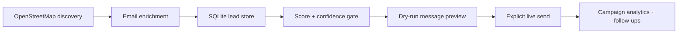

# Outreach Agent

A review-first, multi-business lead-generation and outreach system. It discovers local businesses from OpenStreetMap, enriches contact details, ranks leads, generates concise outreach drafts, and records campaign outcomes in SQLite.

The project is designed to make outreach observable and deliberate: unverified addresses are excluded by policy, campaigns are previewed by default, and live delivery needs an explicit command-level confirmation.

## What it demonstrates

- Agent workflow design: discovery, enrichment, scoring, campaign preparation, delivery, and follow-up
- Reliability: database-backed deduplication, do-not-contact suppression, retry handling, and campaign audit records
- Deliverability controls: confidence thresholds, source allow-listing, pattern-address exclusion, and daily delivery caps
- Product thinking: CSV exports, analytics queries, and a responsive campaign dashboard


```mermaid
flowchart LR
    A[OpenStreetMap discovery] --> B[Email enrichment]
    B --> C[SQLite lead store]
    C --> D[Score + confidence gate]
    D --> E[Dry-run message preview]
    E --> F[Explicit live send]
    F --> G[Campaign analytics + follow-ups]
```

## Quick start

```powershell
cd "RESTURANT AGENT"
python -m pip install -r requirements.txt
Copy-Item .env.example .env
```

Configure `.env` with a location and, when needed, OpenAI and Gmail credentials:

```env
LOCATION_COORDS=26.9124,75.7873
OPENAI_API_KEY=your_key
EMAIL_ADDRESS=you@example.com
EMAIL_PASSWORD=your_gmail_app_password
```

Discover leads and populate the local SQLite database:

```powershell
python scraper.py --type restaurant
```

Preview a confidence-gated campaign. This command never sends email:

```powershell
python agent.py --dry-run --type restaurant --max-leads 10 --min-confidence 0.70
```

After reviewing the preview, live delivery remains bounded and requires both flags:

```powershell
python agent.py --send --confirm-send --max-leads 10 --daily-cap 25
```

## Campaign policy

Only contacts with at least 70% confidence and an approved source (`website`, `osm`, `hunter`, `clearbit`, or `manual`) are eligible. Pattern-generated addresses are excluded until manually verified. The sender checks campaign history to avoid repeat delivery and applies a daily cap before each batch.

## Commands

| Command | Purpose |
| --- | --- |
| `python scraper.py --type restaurant` | Discover and enrich leads |
| `python agent.py --dry-run` | Render a safe campaign preview |
| `python agent.py --send --confirm-send` | Deliver a reviewed campaign |
| `python workflow.py --export` | Export contacts and campaign data to CSV |
| `python workflow.py --stats` | Show campaign metrics |
| `python workflow.py --followup --test` | Preview scheduled follow-ups |
| `python analytics.py` | Print performance analysis from SQLite |

## Validation

```powershell
python -m pytest tests -q
```

The test suite covers lead filtering, email extraction, scraping integration, confidence gating, and daily-cap behavior.

## Resume-ready description

Built a Python outreach agent that turns OpenStreetMap business data into confidence-scored lead campaigns, with multi-source email enrichment, SQLite-based campaign state, AI-assisted message drafting, deliverability controls, and analytics exports. Added review-first delivery with duplicate suppression, do-not-contact handling, source validation, and configurable daily send limits.

## Project layout

| Path | Responsibility |
| --- | --- |
| `scraper.py` | Business discovery, enrichment, and lead persistence |
| `agent.py` | Campaign preview and deliberate delivery |
| `utils/campaign.py` | Confidence and source policy enforcement |
| `utils/database.py` | SQLite schema and campaign audit trail |
| `utils/ai_email.py` | AI-assisted message generation with a local fallback |
| `analytics.py` / `dashboard.html` | Reporting and campaign visualization |

Use only with a legitimate business purpose and honor applicable privacy, consent, and anti-spam requirements.
